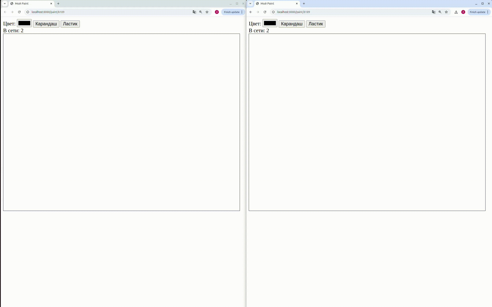

# Go Paint

## Совместное рисование в реальном времени через комнаты



Go Paint позволяет нескольким пользователям одновременно работать на общем холсте в созданной комнате для рисования с уникальным id.

## Запуск через Docker

## Сборка и запуск приложения

1. Клонируйте репозиторий и перейдите в папку с проектом
```bash
   git clone https://github.com/darina-stasevich/paint.git
   cd paint
```

2. Соберите Docker-образ и запустите его:
```bash
   docker build -t go-paint .
  docker run -d -p 8080:8080 --name paint-app go-paint
```
3. Запустите в браузере по адресу http://localhost:8080